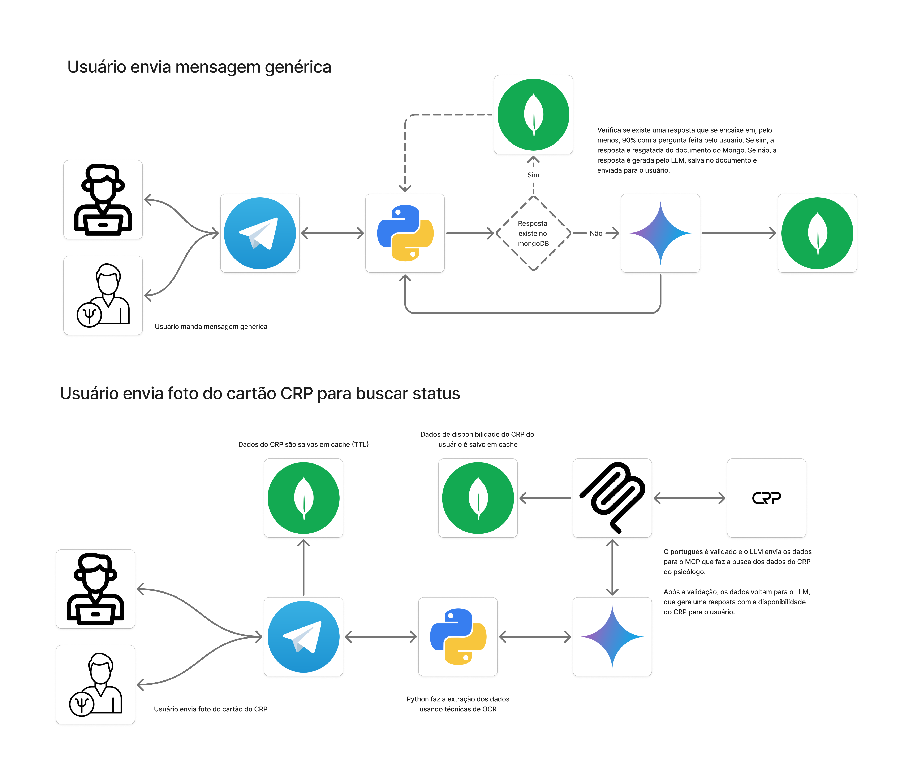

# ValidaCRP

Valida CRP é um agente de IA que ajuda o secretario do Conselho Regional de Psicologia e/ou a pessoa psicóloga a validar, de maneira fácil e prática, via telegram, a disponibilidade do CRP de determinada pessoa psicóloga.

O intuito é que seja reduzido o esforço do psicólogo ao consultar seus dados no cadastro.cfp.org.br.

**IMPORTANTE: todos os dados utilizados para verificar a disponibilidade do CRP da pessoa psicóloga está disponível na internet no link https://cadastro.crp.org.br**

# Tecnologias utilizadas
* Python
* LangChain
* MongoDB
* Pytesseract & tesseract
* API Telegram

# Casos de uso

Temos alguns cenários que _ainda_ não foram desenhados:
1. Usuário envia um áudio solicitando a validação;
2. Através do texto direto ele solicita a validação.

Estes cenários estão em backlog para serem arquitetados e posteriormente implementados ao código.